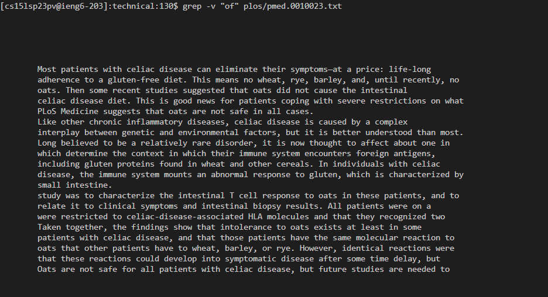
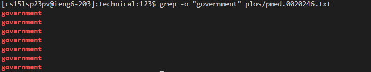

**Researching Grep**
---
For this lab, I will be researching the command `grep`. `grep` is able to search for a pattern within a file and displays it. I will also be exploring a few different command line options for `grep`

**Command-line Options for Grep**
---
**1. grep -r**

`grep -r` is used to recursively search a particular string in all the files in the current directory. It is useful because it allows you to search for a pattern in all files at once instead of searching through each file individually, which can save a lot of time.

For example, here I typed in `grep -r "truth"`. I expect it to search for the word "truth" recursively in the current directory.

We can see that `grep -r "truth"` searched through all the files in the technical directory and showed all the lines in the files that contains "truth". 

Another example of `grep -r` working is when I typed in `grep -r "hummingbirds"`. It should search for the word "hummingbirds" recursively in the current directoy.

Here `grep -r "hummingbirds"` showed all the lines of the files in the techincal directory that contains the string "hummingbirds". This would have had the same result as looking up `grep "hummingbirds" plos/journal.pbio.0020350.txt` because plos/journal.pbio.0020350.txt is the only file containing "hummingbirds".

**2. grep -c**

`grep -c` is used to count the number of times a specific pattern appears in a file.

For example, here I typed in `grep -c "policy" plos/pmed.0020246.txt`. I expect it to print out the number of times "policy" appeared in the file plos/pmed.0020246.txt.

The output is 3, which is what I expected because 3 represents the number of times the word "policy" appeared in the file.

Here I will show another example of using `grep -c` by putting in `grep -c "hummingbirds" plos/journal.pbio.0020350.txt`. I expect it to show me the number of times "hummingbirds" show up in the  file plos/journal.pbio.0020350.txt. I expect the answer to be 4 because from using `grep -r` I discovered that there are 4 lines in the file containing "hummingbirds".

We can see that indeed the prediction is right. It printed out 4 because the word "hummingbirds" showed up 4 times in the file.

**3. grep-v**

`grep -v` is used to search for lines that do not contain the pattern in the single file.

For example, I typed in `grep -v "of" plos/pmed.0010023.txt`. I expect the output to print all the lines in the file that does not contain the string "of".

This matches up with the prediction, we can see that the output contains the lines in the file plos/pmed.0010023.txt and none of these lines contain the string "of".

Another example of using `grep -v` is shown by putting in `grep -v "the" plos/journal.pbio.0020001.txt`. I expect it to print all the lines in the file that does not contain "the".

It successfully printed out all the lines in the file plos/journal.pbio.0020001.txt and we can see that none of the lines printed out contains "the".

**4. grep -o**

`grep -o` is used to print only the matched parts of a matching line. If a pattern is put in and the file contains the patter, then it would only print out the specific pattern for however many lines that contain the pattern. 

For example, here I put in `grep -o "government" plos/pmed.0020246.txt`. I expect it to print out "government" for the number of lines that contain "government"/

We can see that only the word "government" is printed, and it is printed 7 times because there are 7 lines that contain "government".

I will show another example of this by going back to our hummingbirds example. Here I put in `grep -o "hummingbirds" plos/journal.pbio.0020350.txt`. I expect it to print "hummingbirds" 4 times because we learned from the previous commands that there are 4 lines in the file that contain the word "hummingbirds".

This matches up with our expectation. It printed out only the word "hummingbird" 4 times because "hummingbirds" appeared in 4 lines of the file.

That is it for our lab about some of the command-line options for `grep`. I hope you learned some more about `grep` from this tutorial!
