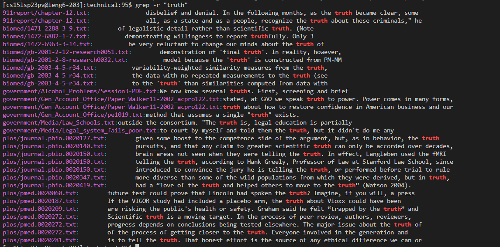

**Researching Grep**
---
For this lab, I will be researching the command `grep`. `grep` is able to search for a pattern within a file and displays it. I will also be exploring a few different command line options for `grep`

**Command-line Options for Grep**
---
**1. grep -r**
`grep -r` is used to recursively search a particular string in all the files in the current directory. It is useful because it allows you to search for a pattern in all files at once instead of searching through each file individually, which can save a lot of time.

For example, here I typed in `grep -r "truth"`. I expect it to search for the word "truth" recursively in the current directory.

We can see that `grep -r "truth"` searched through all the files in the technical directory and showed all the lines in the files that contains "truth". 

Another example of `grep -r` working is when I typed in `grep -r "hummingbirds"`. It should search for the word "hummingbirds" recursively in the current directoy.

Here `grep -r "hummingbirds" showed all the lines of the files in the techincal directory that contains the string "hummingbirds". This would have had the same result as looking up `grep "hummingbirds" plos/journal.pbio.0020350.txt` because plos/journal.pbio.0020350.txt is the only file containing "hummingbirds".

**2. grep -c**
`grep -c` is used to count the number of times a specific pattern appears in a file.

**3. grep-v**
`grep -v` is used to search for lines that do not contain the pattern in the single file.

